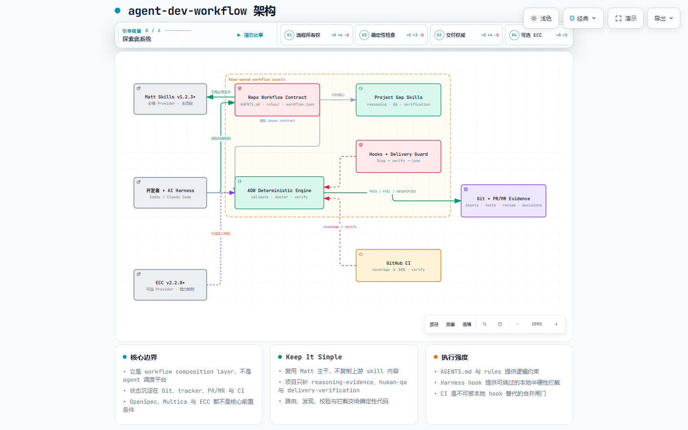

# agent-dev-workflow

[完整中文使用说明](README.ZH.md)

一套以 Matt Pocock Skills 为主干、以 Git 仓库为资产中心的 AI 开发工作流。它不是新的 Agent 平台，也不会替你调度远程 Agent；它把需求、上下文、决策、ticket、证据和交付 Gate 组织成一条可检查的路径。

## 先看结论

```text
Align → Destination → Journey → Implement → Auto Review → Human Acceptance → Verify & Merge
```

- Matt Skills `v1.2.3+` 必需：提供需求盘问、规格、纵向切片、TDD 实现和自动审查。
- 本仓库负责补缺口：`reasoning-evidence`、`human-qa`、`delivery-verification`、Context/ADR Map、确定性校验。
- ECC `v2.2.0+` 可选：只做 capability 适配，不内嵌、不接管流程。
- 本地 hook 只是提前反馈；CI 和人工批准才是最终合并依据。
- Align 内部顺序固定为“术语对齐 → 需求盘问 → 边界澄清”；术语未全部确认前不得开始 grilling。



[交互式架构图](docs/assets/agent-dev-workflow-architecture.html)

## 5 分钟开始

### 路径 A：先验证本仓库

本仓库无运行时依赖，不需要 `npm install`。要求 Node.js 22 或更高版本：

```bash
git clone https://github.com/ymj4023/agent-dev-workflow.git
cd agent-dev-workflow
node --version
npm test
npm run coverage
npm run validate
npm run doctor
npm run verify
```

预期结果：所有测试通过，`validate` 报 workflow manifest 有效，`doctor` 找到 7 个必需 Matt skill，`verify` 报 repository contract 有效。`doctor` 输出的 ECC 缺失是 optional gap，不会阻断核心流程。

### 路径 B：接入已有业务仓库

从工作流仓库根目录先执行 dry-run。installer 只操作现有 Git 仓库，计划中会列出全部目标路径和 action：

```bash
node scripts/adw.mjs install <你的项目目录> --dry-run
```

- 全部 action 为 `create` 时，执行安装并检查状态：

  ```bash
  node scripts/adw.mjs install <你的项目目录>
  node scripts/adw.mjs status <你的项目目录>
  ```

- 出现 `preserve-unowned` 时，installer 不会覆盖目标文件。先逐个比较并把必要入口人工合并到项目已有文件；确认所有冲突文件都由项目自行维护后，再显式接受并安装其余资产：

  ```bash
  node scripts/adw.mjs install <你的项目目录> --accept-existing
  node scripts/adw.mjs status <你的项目目录>
  ```

`--accept-existing` 会把本次全部未托管冲突文件登记为“项目自管”：repair 永不覆盖，uninstall 永不删除。运行前必须逐个确认 dry-run 列出的文件，不能把该 flag 当成跳过审查。

对于 material 这类已经有 `AGENTS.md`、根 Map 和 `docs/agents/` 的成熟仓库，首次 dry-run 出现多项 `preserve-unowned` 是正常结果，不是安装器故障。先把术语前置规则、工作流入口和 Map 分支合入现有文件，再使用 `--accept-existing`；没有显式接受前，普通 install 遇到任一冲突会整体停止写入，避免半安装。

安装结果记录在目标仓库 `.agent-dev-workflow/ownership.json`，只包含相对路径和 SHA-256。更新工作流版本后先运行 `status`：缺失托管文件可以 repair；`outdated` 会变成 `review-update`，必须人工比对后删除旧文件再 repair，或手工替换成新源内容后重新登记。卸载也必须先 dry-run：

```bash
node scripts/adw.mjs repair <你的项目目录> --dry-run
node scripts/adw.mjs repair <你的项目目录>
node scripts/adw.mjs uninstall <你的项目目录> --dry-run
node scripts/adw.mjs uninstall <你的项目目录>
```

installer 会安装 `AGENTS.md`、Context/ADR Map、工作流 manifest、rules 和三个项目缺口 skill。它不会自动改业务代码、接入 CI 或启用 harness hook；这些仍需根据目标项目人工配置。

接入后的最低目录应类似：

```text
<你的项目目录>/
├── AGENTS.md                 # 合并工作流入口
├── CONTEXT-MAP.md            # Context 根 Map
├── ADR-MAP.md                # ADR 根 Map
├── docs/contexts/             # 递归 Context
├── docs/adr/                 # 递归 ADR
├── rules/workflow.md
├── rules/evidence.md
└── skills/                   # 只放项目缺口 skill
```

### 准备 Matt skills

本仓库只检查安装状态，不复制 Matt 内容。必须能发现以下 7 个 skill：

```text
grill-with-docs  domain-modeling  to-spec  to-tickets
implement        tdd              code-review
```

按 [Matt Pocock Skills](https://github.com/mattpocock/skills) 自己的安装说明完成安装，然后运行：

```bash
npm run doctor
```

如果 skill 不在默认目录，用环境变量指定目录：

```bash
MATT_SKILLS_DIR=<Matt skills 目录> npm run doctor
```

`doctor` 同时检查文件是否存在、lock 中的来源是否为 `mattpocock/skills`、版本是否达到 `v1.2.3`。文件名存在但来源未知时仍会失败，这不是误报。

## 一次完整交付怎么做

先在业务仓库创建一个 Destination 和 Journey：

```bash
mkdir -p .scratch/<feature>/issues
```

`.scratch/<feature>/spec.md` 写目标、成功标准、测试缝和非目标；`.scratch/<feature>/issues/01-*.md` 写第一个纵向切片及 `Blocked by`。然后在 AI harness 中按下面的顺序工作：

| 阶段 | 你和 Agent 做什么 | 必须留下的证据 |
| --- | --- | --- |
| Align | 先读相关 Context/ADR；逐一确认核心术语，再运行 `grill-with-docs`/`domain-modeling` 盘问需求，最后澄清边界 | 术语表、人类确认、边界、未知项和冲突 ADR |
| Destination | 用 `to-spec` 把共识写入 `spec.md`；明确结果、验收、测试缝和非目标 | 可评审的 Destination |
| Journey | 用 `to-tickets` 把 Destination 拆成 blockers-first 的纵向 ticket；人类批准切片和依赖边 | ticket 文件、`Blocked by` 和人工批准 |
| Implement | 一次只取一个 ticket；用 `implement` + `tdd` 按 red → green 完成可观察行为 | 失败测试、最小实现、通过测试和 diff |
| Auto Review | 在 fresh context 运行 `code-review`；不要把实现上下文当作审查证据 | review finding、修复或明确 out-of-scope |
| Human Acceptance | 用 `human-qa` 检查行为、测试价值、接口失败模式和真实可用性 | 四个问题的 accepted/rejected/unverified 决定 |
| Verify & Merge | 运行项目 test/lint/build/security/CI；再运行 `delivery-verification`，由人批准合并 | 命令、结果、未验证项和合并决定 |

推荐给 Agent 的第一句话：

```text
请先读取 AGENTS.md，然后只沿当前 ticket 相关的 CONTEXT-MAP.md 与 ADR-MAP.md 递归读取。
先只做术语对齐：列出核心术语，并逐一确认定义、适用范围、排除范围、歧义或易混概念。
把结果整理成术语表，逐项等我确认。全部术语确认前，不要调用 grill-me、grill-with-docs 或 /grilling，
也不要开始需求澄清。术语统一后，再依次进行需求盘问和边界澄清；不要写代码。
```

建议术语表格式：

| 术语 | 定义 | 适用范围 | 排除范围 | 歧义/易混概念 | 确认状态 |
| --- | --- | --- | --- | --- | --- |
| `<术语>` | `<这个词具体指什么>` | `<哪些场景属于>` | `<哪些场景不属于>` | `<容易与什么混淆>` | `待确认/已确认` |

这里的 `grill-me` 泛指 Matt 的需求盘问入口；本工作流默认使用能同时沉淀 ADR 和 glossary 的 `grill-with-docs`。二者都必须排在术语对齐之后。

任何 review 或 QA 拒绝都转成新的小 Journey ticket；除非产品决定改变，否则保留原 Destination。

## 本仓库命令

| 命令 | 用途 | 失败意味着什么 |
| --- | --- | --- |
| `npm test` | 运行单元/契约/CLI 测试 | 代码或工作流契约有回归 |
| `npm run coverage` | 运行测试并检查 80% line/function 门槛 | 覆盖率不足或测试失败 |
| `npm run validate` | 校验 `manifests/workflow.json` 的阶段和依赖 | manifest 不能削弱 Matt-first 主干 |
| `npm run doctor` | 检查 Matt skill 文件、来源、版本及可选 ECC gap | 必需能力缺失或 provenance 未验证 |
| `npm run verify` | 校验本仓库的必需文件、Map、skill、ECC 映射 | 仓库资产不完整或发生漂移 |
| `node scripts/adw.mjs install <repo> --dry-run` | 预览初始化 | 列出每个目标路径及 create/conflict action，不写文件 |
| `node scripts/adw.mjs install <repo>` | 安装缺失资产 | 有未托管冲突时整体不写并返回 `NOT_READY` |
| `node scripts/adw.mjs status <repo>` | 检查安装状态 | 报告 missing/outdated/modified/unowned |
| `node scripts/adw.mjs repair <repo>` | 恢复托管资产 | 只恢复缺失文件；outdated/modified 必须人工处理 |
| `node scripts/adw.mjs uninstall <repo>` | 安全卸载 | 只删除哈希仍匹配 ledger 的托管文件 |

这几个命令只做确定性检查，不替代业务项目自己的集成测试、E2E、构建和人工验收。

## Hook、CI 与 Provider

- `hooks/adapters/` 只把 Codex/Claude 的事件映射到共享 guard；安装前确认目标 harness 把退出码 `2` 当作阻断。
- `.github/workflows/verify.yml` 执行 coverage 和 verify；CI 是合并权威。
- Matt 是必需 Provider；ECC 只映射 `verification-loop`、`eval-harness`、`security-review`、`contract-first` 等能力。
- OpenSpec、Multica、GitHub `gh-aw`、Symphony 和远程 Agent 调度都不是本仓库的核心前置条件。

## 递归文档怎么维护

```text
CONTEXT-MAP.md → docs/contexts/CONTEXT-MAP.md → <领域>/CONTEXT-MAP.md → CONTEXT.md
ADR-MAP.md     → docs/adr/ADR-MAP.md         → <领域>/ADR-MAP.md         → 0001-*.md
```

Map 只列直接子级，不跨级列孙级。新增、移动或删除文档时只更新直接父 Map；`npm run verify` 会检查断链、重复、跨级、路径逃逸和 orphan 文档。

## 当前明确不做

本项目不托管远程 Agent、不创建 issue control plane、不自动合并目标项目已有文件、不替代业务仓库的 test/build/lint，也不把个人 harness 中的资产当作团队唯一事实源。

架构图：[PNG](docs/assets/agent-dev-workflow-architecture.png) · [Archify 交互式 HTML](docs/assets/agent-dev-workflow-architecture.html)
